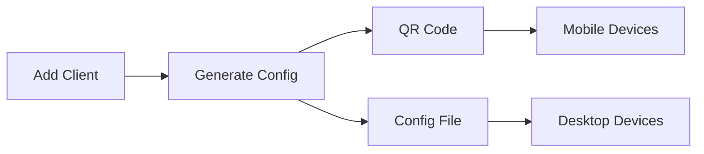
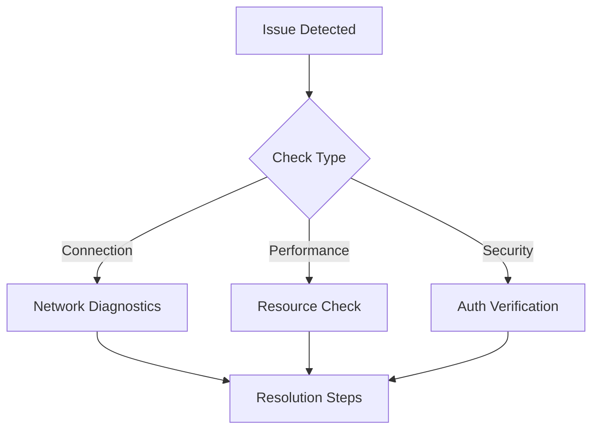

<div align="center">

# 👁️ **godEye: Neural Interface for PiVPN** 👁️


[](https://github.com/subGOD/godEye/stargazers)
[](https://github.com/subGOD/godEye/network/members)


**🔒 The Future of VPN Management Has Arrived**

</div>

---

## 🧠 **About godEye**

godEye is not just another VPN interface - it's a neural gateway to your PiVPN installation. Built with cutting-edge technology and a cyberpunk aesthetic, godEye transforms your Raspberry Pi into a sophisticated VPN management system.

### 🌟 **Key Features**

- **Neural Dashboard**: Real-time network monitoring with advanced visualizations
- **Quantum-Secured Authentication**: State-of-the-art security protocols
- **Bio-Digital Integration**: Seamless user experience with responsive design
- **Neural-Link Management**: Easy client configuration and monitoring
- **Quantum Tunneling**: Advanced WireGuard protocol integration
- **Matrix-Style Logging**: Comprehensive system monitoring and alerts

### 🎯 **Perfect For**

- Home Network Administrators
- Cybersecurity Enthusiasts
- Privacy-Conscious Users
- Small Business VPN Solutions
- Remote Work Teams
- Tech Innovation Leaders
## 🛠️ **Neural Enhancement Modules (Tech Stack)**

<div align="center">

### Frontend Neural Interface
[](https://reactjs.org/)
[](https://vitejs.dev/)
[](https://tailwindcss.com/)
[](https://www.typescriptlang.org/)

### Backend Neural Core
[](https://nodejs.org/)
[](https://expressjs.com/)
[](https://redis.io/)
[](https://www.nginx.com/)

### Neural Security Protocols
[](https://jwt.io/)
[](https://www.npmjs.com/package/bcrypt)
[](https://www.wireguard.com/)

### Quantum Development Tools
[](https://git-scm.com/)
[](https://code.visualstudio.com/)
[](https://www.npmjs.com/)

</div>

## 🚀 **Neural Interface Initialization (Installation)**

### Prerequisites
- Raspberry Pi (3B+ or newer)
- PiVPN installed and configured
- 1GB+ RAM
- 1GB+ free disk space
- Basic understanding of neural networks (kidding!)

### One-Line Neural Upload
```bash
curl -sSL https://raw.githubusercontent.com/subGOD/godeye/main/install.sh | sudo bash
```

### Manual Neural Synchronization
```bash
# Clone the neural repository
git clone https://github.com/subGOD/godeye.git
cd godeye

# Initialize neural pathways
npm install

# Activate neural interface
npm run build
```

### Neural Interface Removal (Uninstall)
```bash
# Quick neural detachment
curl -sSL https://raw.githubusercontent.com/subGOD/godeye/main/uninstall.sh | sudo bash

# Manual neural cleanup
sudo systemctl stop godeye godeye-api
sudo systemctl disable godeye godeye-api
sudo rm -rf /opt/godeye
sudo rm /etc/nginx/sites-enabled/godeye
sudo rm /etc/nginx/sites-available/godeye
sudo systemctl restart nginx
```

### Post-Installation Neural Verification
After installation, access your neural interface at:
```
http://your-pi-ip:1337
```

Default Neural Access Credentials:
- Username: `admin`
- Password: (set during installation)
## 🌟 **Neural Interface Capabilities**

<div align="center">
  
</div>

### 🎯 **Core Neural Functions**

#### 🔮 Real-Time Neural Monitoring
- Live network traffic visualization
- Active client monitoring
- Bandwidth usage analytics
- System resource tracking
- Real-time threat detection

<div align="center">
  
</div>

#### 🛡️ Quantum Security Features
- Advanced authentication system
- Fail2ban integration
- UFW firewall management
- SSL/TLS encryption
- Intrusion detection system

<div align="center">
  
</div>

#### 🔄 Client Neural Management


- One-click client addition
- QR code configuration
- Automatic key generation
- Client status monitoring
- Bandwidth limiting
- Client removal automation

#### 📊 Neural Analytics
- Bandwidth usage graphs
- Connection statistics
- Client activity logs
- Performance metrics
- System health monitoring

<div align="center">
  
</div>

#### 🛠️ Advanced Neural Configuration
- Custom DNS settings
- Port forwarding
- Split tunneling
- IP management
- Protocol optimization

### 💫 **User Experience Enhancement**

| Feature | Description | Status |
|---------|-------------|--------|
| Dark Theme | Cyberpunk-inspired interface | ✅ |
| Responsive Design | Mobile-first approach | ✅ |
| Real-time Updates | Live data synchronization | ✅ |
| One-Click Actions | Simplified management | ✅ |
| Multi-language | International support | 🚧 |
| Theme Customization | Personal preferences | 🚧 |

### 🎮 **Control Interface**

```bash
# Quick Commands
systemctl status godeye          # Neural interface status
systemctl restart godeye         # Neural reboot
journalctl -u godeye -f         # Neural activity logs
```

<div align="center">
  
</div>
## 📚 **Neural Knowledge Base**

### 🔧 **Troubleshooting Matrix**

Common Neural Synchronization Issues:


| Issue | Neural Command | Description |
|-------|----------------|-------------|
| Service Down | `sudo systemctl status godeye` | Check neural interface status |
| Logs Review | `journalctl -u godeye-api -f` | Monitor neural activity |
| Port Conflict | `sudo netstat -tulpn \| grep 1337` | Check neural port availability |
| Permission Error | `sudo chmod -R 755 /opt/godeye` | Reset neural permissions |

### 🛟 **Support Channels**

<div align="center">

[](https://discord.gg/godEyeSupport)
[](https://reddit.com/r/godEye)
[](https://github.com/subGOD/godEye/discussions)

</div>

- 🎮 **Discord**: Real-time support and community discussion
- 📡 **GitHub Issues**: Bug reports and feature requests
- 📖 **Wiki**: Comprehensive documentation and guides
- 💭 **Reddit**: User experiences and tips
- 🤝 **Discussions**: Technical deep-dives and solutions

## 🤝 **Neural Network Enhancement (Contributing)**

### Development Setup
```bash
# Clone Neural Repository
git clone https://github.com/subGOD/godEye.git

# Neural Pathway Installation
cd godEye
npm install

# Development Neural Interface
npm run dev

# Neural Testing
npm test

# Neural Build
npm run build
```

### Contribution Guidelines

1. 🔍 **Neural Issue Detection**
   - Search existing issues
   - Create detailed bug reports
   - Follow issue template

2. 🧬 **Neural Branch Creation**
   ```bash
   git checkout -b feature/amazing-enhancement
   ```

3. 🔮 **Neural Code Implementation**
   - Follow coding standards
   - Add documentation
   - Include tests

4. 🧪 **Neural Testing**
   ```bash
   npm run test
   npm run lint
   ```

5. 🎯 **Neural Pull Request**
   - Clear description
   - Reference issues
   - Update documentation

### Neural Code Standards
```javascript
// Example Neural Component
const NeuralComponent = ({ data }) => {
  // Neural processing logic
  return (
    <div className="neural-interface">
      {/* Neural interface elements */}
    </div>
  );
};
```

## 📜 **Neural License**

<div align="center">

[](https://opensource.org/licenses/MIT)

</div>

This neural interface is released under the MIT License. See [LICENSE](LICENSE) for more information.

## 🙏 **Neural Acknowledgments**

<div align="center">

Made with 🧠 by [subGOD](https://github.com/subGOD)

Special thanks to all neural contributors and the PiVPN community.

[](https://github.com/subGOD/godEye/stargazers)

</div>